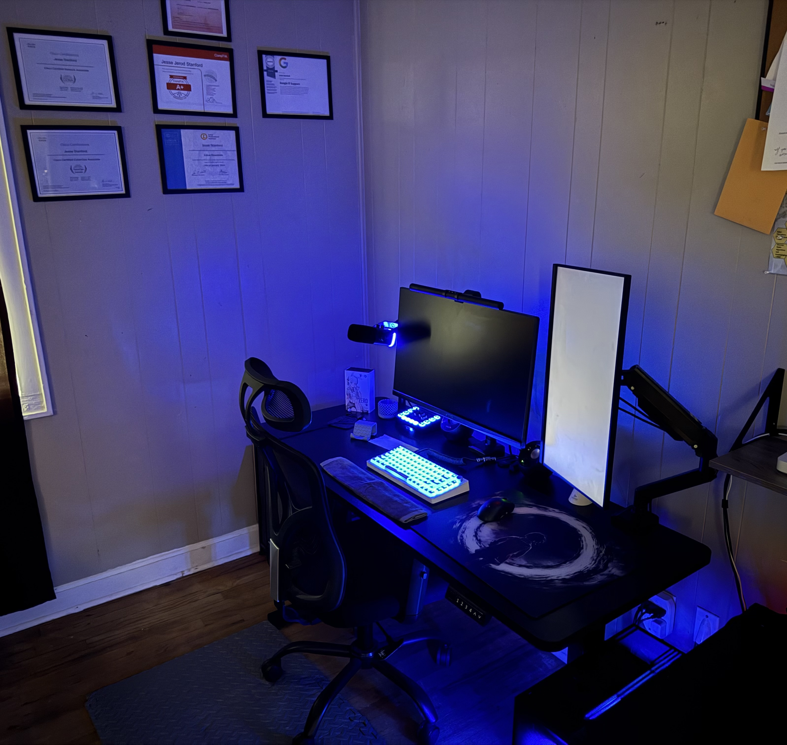
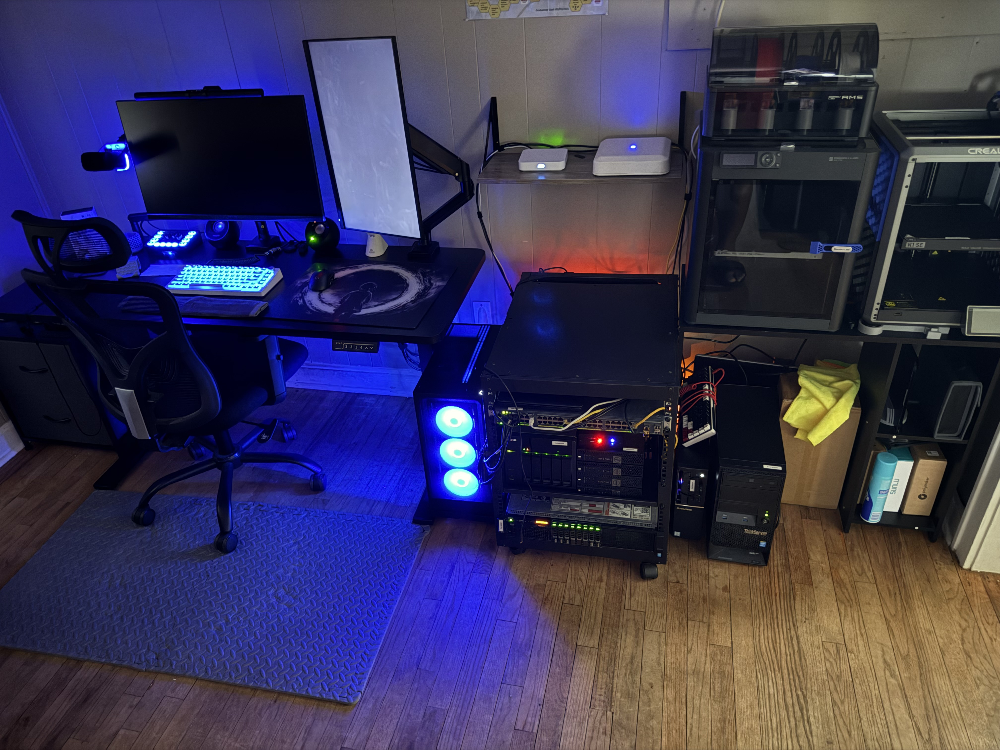

# Hi, I'm Jesse! [Systems Analyst II | Network Engineering & Security Student](https://www.linkedin.com/in/jjstanford314/)

## About Me:

I’m a **Systems Analyst II** with a strong background in IT operations, systems administration, and networking. I spend my days keeping systems stable, solving technical problems, and making sure infrastructure runs the way it should—efficient and secure.

Outside of work, I’m big on continuous learning. I’ve built multiple **homelabs** where I dive into everything from VMware virtualization and networking setups to cybersecurity detection and self-hosted services. Whether it's configuring firewalls, setting up clusters, or automating tasks with PowerShell and Linux, I like staying hands-on and sharpening my skills.

I’m especially focused on growing in **network engineering**, **systems administration**, and **cybersecurity**—bridging the gap between managing infrastructure and securing it. When I’m not deep in tech, you’ll probably catch me gaming or working on new lab projects.

Always open to connecting, collaborating, or just talking tech!

---

## 👨‍💻 My Projects:

- **[Active Directory Home Lab](https://github.com/jstanford314/ActiveDirectoryLab)**
- **[Cybersecurity Detection Home Lab](https://github.com/jstanford314/DetectionHomeLab)**
- More coming soon — always building something in the lab.

---

## 🎓 Certifications:

- [Google IT Support Professional](https://coursera.org/share/8a8fd262d96165fe0addc9a00cce14f8)
- [CompTIA A+](https://www.credly.com/badges/67bdcab5-ca9b-436b-a80c-5e5736e89013/linked_in_profile)
- [Cisco Certified Network Associate (CCNA)](https://www.credly.com/earner/earned/badge/bac0e54e-873b-4d1b-aca2-c9dc004a019a)
- [Cisco Certified Cybersecurity Associate (CCCA)](https://www.credly.com/earner/earned/badge/03b627ee-d350-4a81-889e-a116338d843b)
- [Linux Essentials (LPI)](https://www.credly.com/earner/earned/badge/14f5d66e-61e2-403a-96d2-d0754e2566f6)
- ITIL v4 Foundation

---

## 🖥️ My Setup:

Here’s where all the projects, labs, and a bit of gaming happen. I’m all about keeping a clean, efficient workspace—whether I’m working on network configs, spinning up VMs, or running a few matches after hours.

---

<!--
## 📺 YouTube Videos

Coming soon...

## 🤳 Connect with me:

-->
